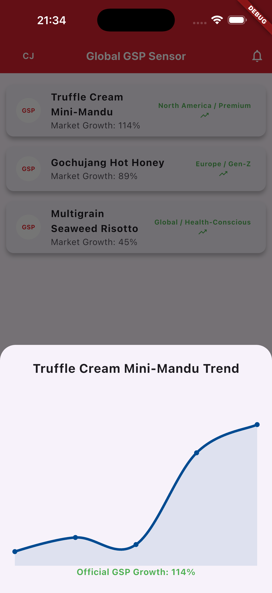
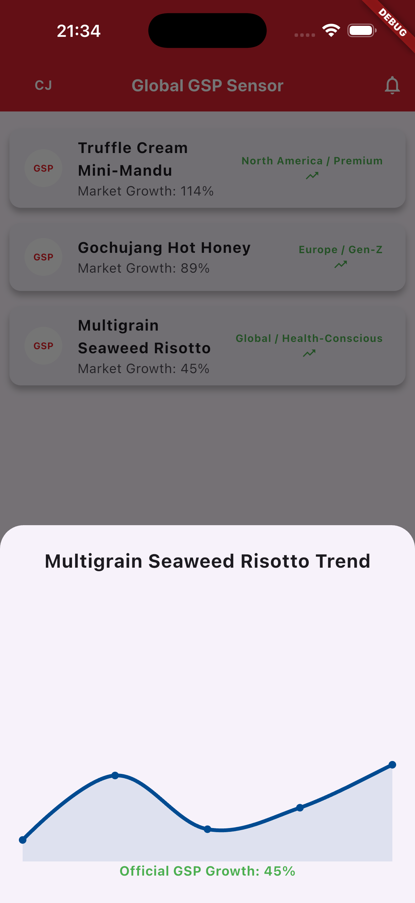
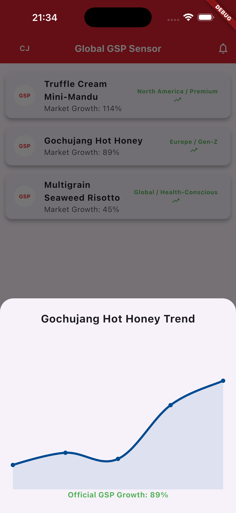

# CJ Foods Global GSP Trend Tracker

An AI-driven market intelligence dashboard developed for the **CJ Foods 2026 Strategy Initiative**. This application provides real-time visualization of Global Strategic Product (GSP) performance across international markets.

## 🚀 Overview
This full-stack application serves as a "Trend Sensor," bridging the gap between raw market data and executive decision-making. It identifies high-growth SKUs (like Gochujang and Mandu) and visualizes their trajectory using dynamic analytics.

## 🛠 Tech Stack
- **Frontend:** Flutter (Dart) - Cross-platform mobile dashboard.
- **Backend:** Spring Boot (Java) - RESTful API service.
- **Data Visualization:** fl_chart - Custom normalized growth mapping.
- **Version Control:** Git/GitHub.

## ✨ Key Features
- **Real-time Data Sync:** Fetches live trend metrics from a Spring Boot backend.
- **Dynamic Growth Analytics:** Custom-built line charts that normalize high-variance growth data (e.g., Gochujang's 89% spike) for clear UI presentation.
- **Brand-Aligned UI:** Designed with CJ Group’s corporate visual identity (CJ Navy Blue).
- **Interactive Drill-down:** Clickable product cards providing deep-dive performance analysis.

## 📸 Screenshots
 
### Dashboard Overview

### Dynamic Growth Analytics

## ⚙️ Installation
1. Clone the repository.
2. Run the Spring Boot backend (`./mvnw spring-boot:run`).
3. Launch the Flutter app (`flutter run`).
